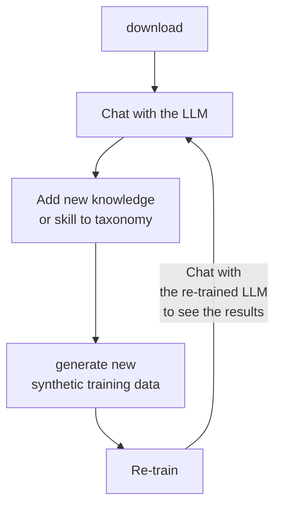

# IBM x Red Hat InstructLab Hackathon 

* **Disclaimer Note:** All credits are attributed to the original sources. The information consolidated here was strictly used for personal referencing based on the original repository source documentation.
___

Synthethic data-based alignmnet tuning for Large Language Models (LLMs), using the Large-Scale Alignment for ChatBots (LAB) methodology. LAB is a method for adding new knowledge and skills to existing foundation models by generating synthetic data for the new capability, and then using the generated data to instruction tune the foundation model.

* Generate Examples: High quality, hand-curated knowledge sources, plus curated taxonomy of tasks with human-generated examples for each.
* Teacher Model(s): Teacher model generates "curriculum" of millions of question-answer pairs for the taxonomies.
* Critic Model(s): Critic model filters questions for correctness and quality. Synthetic data is scanned for prohibited material.
* Student Model(s): Student model is trained with the curriculum using novel training approach.

## Key Concepts:

* Knowledge: Adding knowledge means including files with facts, data, policies etc.
* Composition Skills: Adding compositional skills means adding and improving complex behaviours in the model's responses, e.g. act like a personality, classify a transcript, extract information from a table.

## InstructLab CLI Workflow

LAB reduces Instruction Tuning to defining recipes for synthetic data generation.



Add knowledge and skills to the LLM within the taxonomy repository. Use `ilab` to generate synthetic training data based on changes in local `taxonomy` repository. Re-train LLM with new training data. Chat with re-trained LLM to see results.

## Initialization and Model Downloads

Granite will be used as a model server for API requests, and Merlinite will perform the Synthetic Data Generation step. Note at this step, we have not downloaded the Student Model yet.

```bash
# navigate to InstructLab folder, activate python virtual environment
cd ~/instructlab
source venv/bin/activate

# verify ilab installed
ilab

# initialize ilab
ilab config init

# download models - Granite (model server for API requests), Merlinite (Synthetic Data Generation)
ilab model download --repository instructlab/granite-7b-lab-GGUF --filename=granite-7b-lab-Q4_K_M.gguf
ilab model download --repository instructlab/merlinite-7b-lab-GGUF --filename=merlinite-7b-lab-Q4_K_M.gguf

# inspect downloaded models
ilab model list
```

Test serve and chat with Granite model:

```bash
# serve Granite model
ilab model serve --model-path /home/instruct/.cache/instructlab/models/granite-7b-lab-Q4_K_M.gguf

# begin chat session with ilab model chat (type "exit" to quit chat)
ilab model chat -m /home/instruct/.cache/instructlab/models/granite-7b-lab-Q4_K_M.gguf
```

## `ilab` Directory Layout

After running `ilab config init` your directories will look like the following on a Linux system:

| **Directory**                              | **Description**                                                                 |
|--------------------------------------------|---------------------------------------------------------------------------------|
| `~/.cache/instructlab/models/`             | Contains all downloaded large language models, including the saved output of ones you generate with ilab.|
| `~/.local/share/instructlab/datasets/`     | Contains data output from the SDG phase, built on modifications to the taxonomy repository.   |
| `~/.local/share/instructlab/taxonomy/`     | Contains the skill and knowledge data.                                              |
| `~/.local/share/instructlab/checkpoints/`  | Contains the output of the training process.                                |
| `~/.config/instructlab/config.yaml`        | Contains the `config.yaml` file |

You can view your `config.yaml` file with the following command (use `-k` to show a specific config section and/or `-wc` to show without comments):

```bash
ilab config show
```

## Create New Knowledge/Skills for Training Model

Inspecting Taxonomy Directory:

```bash
# navigate to taxonomy directory
cd /home/instruct/.local/share/instructlab
tree taxonomy | head -n 10
```

Contribute knowledge or compositional skills:

```bash
# create directory for adding new knowledge
mkdir -p /home/instruct/.local/share/instructlab/taxonomy/knowledge/parasol/claims

# copy example qna.yaml file to taxonomy directory
cp -av ~/files/backToTheFuture/qna.yaml /home/instruct/.local/share/instructlab/taxonomy/knowledge/parasol/claims/

# inspect file
head /home/instruct/.local/share/instructlab/taxonomy/knowledge/parasol/claims/qna.yaml

# inspect full file
cat /home/instruct/.local/share/instructlab/taxonomy/knowledge/parasol/claims/qna.yaml
```

List and validate new data - use `ilab taxonomy diff` to ensure new knowledge is properly formatted and registered.

```bash
# validate taxonomy
ilab taxonomy diff
```

## Knowledge Contribution

While skills are foundational or performative, knowledge is based more on answering questions that involve facts, data, or references.

* Each knowledge node in the tree has a `qna.yaml`
* Knowledge submissions require creation of a Git repository, contain the markdown files of knowledge contributions.
* Contributions must use the markdown (`.md`) format

> [!IMPORTANT]
> There is a limit to how much content can exist in the question/answer pairs for the model to process. Due to this, only add a maximum of around 2300 words to your question and answer seed example pairs in the `qna.yaml` file.

### Knowledge YAML Template

```yaml
version: 3	# DO NOT CHANGE!
created_by: "YOUR_GITHUB_USERNAME"
domain: "SPECIFY_KNOWLEDGE_DOMAIN"

# Each YAML needs five `context` blocks. Context have max token count of 500.
# Each context with at least 3 Q&A pairs.

seed_examples:
  - context: |
      # First context block (max 500 tokens)
      # Paste your first chunk of knowledge content here
    questions_and_answers:
      - question: |
          First question about this context?
        answer: |
          Answer to the first question.
      - question: |
          Second question about this context?
        answer: |
          Answer to the second question.
      - question: |
          Third question about this context?
        answer: |
          Answer to the third question.

  - context: |
      # Second context block (max 500 tokens)
      # Paste your second chunk of knowledge content here
    questions_and_answers:
      - question: |
          First question about this context?
        answer: |
          Answer to the first question.
      - question: |
          Second question about this context?
        answer: |
          Answer to the second question.
      - question: |
          Third question about this context?
        answer: |
          Answer to the third question.

  # Add three more context blocks with their respective Q&A pairs
  # following the same structure as above

document_outline: |
  Provide an overview of your knowledge document here.
  Describe what information it contains and its structure.

document:
  repo: "YOUR_GITHUB_REPO_URL"
  commit: "YOUR_COMMIT_SHA"
  patterns:
    - "*.md"  # Ensure YAML points to correct (singular) markdown file
```

### Knowledge YAML Example

```yaml
version: 3
domain: time_travel
created_by: Grant Shipley
seed_examples:
  - context: |
      The DeLorean DMC-12 is a sports car manufactured by John DeLorean's DeLorean Motor Company
      for the American market from 1981 to 1983. The car features gull-wing doors and a stainless-steel body.
      It gained fame for its appearance as the time machine in the "Back to the Future" film trilogy.
    questions_and_answers:
      - question: |
          When was the DeLorean manufactured?
        answer: |
          The DeLorean was manufactured from 1981 to 1983.
      - question: |
          Who manufactured the DeLorean DMC-12?
        answer: |
          The DeLorean Motor Company manufactured the DeLorean DMC-12.
      - question: |
          What type of doors does the DeLorean DMC-12 have?
        answer: |
          Gull-wing doors.
  - context: |
      An engine rebuild costs between $5,000 to $7,000. A transmission rebuild costs between $2,500 to $4,000.
      A brake system overhaul costs between $1,000 to $1,500.
      Suspension work costs between $800 to $1,200.
      Electrical system repairs costs between $600 to $1,000.
      Stainless stell panel work costs between $1,200 to $2,000.
      A gull-wing door mechanism costs between $500 to $800.
      Repairing an air conditioner costs between $300 and $600.
      General maintenance is between $200 and $500 per service.
      A Flux capacitor costs $10,000,000 to repair.
    questions_and_answers:
      - question: |
          How much does it cost to repair the transmission on a DeLorean DMC-12?
        answer: |
          Transmission Repair costs between $2,500 and $4,000 for the Delorean DMC-12.
      - question: How much does it cost to repair the supension on a DeLorean DMC-12?
        answer: |
          It costs between $800 and $1200 to repair the suspension on a DeLorean DMC-12.
      - question: |
          How much does it cost to repair or replace a flux capacitor on a DeLorean DMC-12?
        answer: |
          It costs $10,000,000 to repair a flux capacitor.
  - context: |
      Production Years: 1981–1983
      Body Style: 2-door coupe
      Engine: 2.85 L V6 PRV engine
      Transmission 5-speed manual or 3-speed automatic
      Horsepower 130 hp
      153 lb-ft
      Approximately 8.8 seconds
      110 mph
      2,712 lb (1,230 kg)
      Flux capacitor fitted for time travel and costs $10,000,000
    questions_and_answers:
      - question: What was the production years of the DeLorean DMC-12?
        answer: |
          The car was in production from 1981 to 1983.
      - question: |
          How much horsepower does the DeLorean have?
        answer: |
          It has 130 horsepower.
      - question: |
          What is the flux capacitor used for in a Delorean DMC-12?
        answer: |
          The flux capacitor is used for time travel capabilities and costs $10,000,000.
  - context: |
      Here is a maintenance schedule.
      Regular Oil Changes should be done every 3,000 miles or 3 months.
      Brake Fluid should be changed every 2 years.
      Transmission Fluid should be changed every 30,000 miles.
      Coolant should be changed every 2 years
      You should regularly check the battery for corrosion and proper connection.
      You should add new fluid to the flux capacitor on a regular basis.
    questions_and_answers:
      - question: How often should you change the oil on a DeLorean DMC-12?
        answer: |
          You should change the oil ever 3,000 miles or every 3 months. Whichever comes first.
      - question: |
          How often should changed the blake fluid on a DeLorean DMC-12?
        answer: |
          You should change the blake fluid every two years.
      - question: |
          What should you check on a Delorean DMC-12 as part of a regular maintenance schedule?
        answer: |
          You should consider regular oil changes, blake fluid replacement, transmission fluid, battery,
          flux capacitor and collant.
  - context: |
      Here are some fun facts about the DeLorean DMC-12:
      The DeLorean DMC-12 was originally intended to have a mid-engine layout, but this was later changed
      to a rear-engine layout due to design and cost constraints.
      The DeLorean time machine special edition can time travel by accelerating to 88 miles per hour.
      The flux capacitor, which enables time travel, costs $10,000,000 dollars.
    questions_and_answers:
      - question: |
          How much does it cost to repair a flux capacitor on a Delorean DMC-12?
        answer: |
          It costs $10,000,000 to repair or replace a flux capacitor.
      - question: |
          How fast do you need to be going to enable time travel on a DeLorean DMC-12?
        answer: |
          88 miles per hour.
      - question: |
          What type of layout does a Delorean DMC-12 have?
        answer: |
          It has a rear-engine layout.
document_outline: |
  Details and repair costs on a DeLorean DMC-12 car.
document:
  repo: https://github.com/gshipley/backToTheFuture.git
  commit: 8bd9220c616afe24b9673d94ec1adce85320809c
  patterns:
    - data.md
```

The reference knowledge markdown example is as follows:

```
DeLorean DMC-12

Overview

The DeLorean DMC-12 is a sports car manufactured by John DeLorean's DeLorean Motor Company for the American market from 1981 to 1983. The car features gull-wing doors and a stainless-steel body. It gained fame for its appearance as the time machine in the "Back to the Future" film trilogy.

Specifications

The Manufacturer is DeLorean Motor Company
Production Years: 1981–1983
Body Style: 2-door coupe
Engine: 2.85 L V6 PRV engine
Transmission 5-speed manual or 3-speed automatic
Horsepower 130 hp
153 lb-ft
Approximately 8.8 seconds
110 mph
2,712 lb (1,230 kg)
Flux capacitor fitted for time travel

Here are some common repairs and costs.

An engine rebuild costs between $5,000 to $7,000.
A transmission rebuild costs between $2,500 to $4,000.
A brake system overhaul costs between $1,000 to $1,500.
suspension work costs between $800 to $1,200.
electrical system repairs costs between $600 to $1,000.
Stainless stell panel work costs between $1,200 to $2,000.
A gull-wing door mechanism costs between $500 to $800.
Repairing an air conditioner costs between $300 and $600.
General maintenance is between $200 and $500 per service.
A Flux capacitor costs $10,000,000 to repair.

Here is a maintenance schedule.

Regular Oil Changes should be done every 3,000 miles or 3 months.
Brake Fluid should be changed every 2 years.
Transmission Fluid should be changed every 30,000 miles.
Coolant should be changed every 2 years
You should regularly check the battery for corrosion and proper connection.
You should add new fluid to the flux capacitor on a regular basis.

Here are some fun facts.

The DeLorean DMC-12 was originally intended to have a mid-engine layout, but this was later changed to a rear-engine layout due to design and cost constraints.

The DeLorean time machine special edition can time travel by accelerating to 88 miles per hour.

The flux capacitor, which enables time travel, costs $10,000,000 dollars.

Here are some conclusions.

Owning a DeLorean DMC-12 can be a rewarding experience for classic car enthusiasts, but it requires dedication to regular maintenance and a budget for potential repair costs. With proper care, this iconic vehicle can provide a unique and nostalgic driving experience.
```

## Skill Contribution

Skills require smaller volume of content than knowledge contributions. Skill contribution pull requests must include the following:

* A `qna.yaml` each containing a minimum of five question-answer pairs.
* An `attribution.txt` that includes the sources of information used in the `qna.yaml`

> [!TIP]
> The skill taxonomy structure is used in several ways:
>
> 1. To select the right subset of the taxonomy to use for data generation.
> 2. To determine the interpretability by human contributors and maintainers.
> 3. As part of the prompt to the LLM used to generate synthetic samples.
<!-- -->
> [!IMPORTANT]
> There is a limit to how much content can exist in the question/answer pairs for the model to process. Due to this, only add a maximum
> of around 2300 words to your question and answer seed example pairs in the `qna.yaml` file.

### Skill YAML Template

Skills can either be grounded (includes a context) or ungrounded (does not include a context), where the grounding is declared in the taxonomy tree.

```yaml
version: 2 	# DO NOT CHANGE
task_description: Provide a description of the skill
created_by: "YOUR_GITHUB_USERNAME"
seed_examples:
  - question: Question for the model
    answer: |
      The desired response from the model
  - context: |
      Grounded skills require the user to provide context containing information that the model is expected to take into account during processing. This is different from knowledge, where the model is expected to gain facts and background knowledge from the tuning process. The context key should not be used for ungrounded skills.
    question: <string>
    answer: |
      <multi-line string>
  ...
```

Then, you create an `attribution.txt` file that includes the sources of your information. These can also be self authored sources.

```
[Link to source]
[Link to work]
[License of the work]
[Creator name]
```

### Grounded Compositional Skill YAML Example

```yaml
version: 2
task_description: |
    This skill provides the ability to read a markdown-formatted table.
created_by: mairin # Use your GitHub username; only one creator supported
seed_examples:
  - context: |
      | **Breed**      | **Size**     | **Barking** | **Energy** |
      |----------------|--------------|-------------|------------|
      | Afghan Hound   | 25-27 in     | 3/5         | 4/5        |
      | Labrador       | 22.5-24.5 in | 3/5         | 5/5        |
      | Cocker Spaniel | 14.5-15.5 in | 3/5         | 4/5        |
      | Poodle (Toy)   | <= 10 in     | 4/5         | 4/5        |
    question: |
      Which breed has the most energy?
    answer: |
      The breed with the most energy is the Labrador.
  - context: |
      | **Name** | **Date** | **Color** | **Letter** | **Number** |
      |----------|----------|-----------|------------|------------|
      | George   | Mar 5    | Green     | A          | 1          |
      | Gráinne  | Dec 31   | Red       | B          | 2          |
      | Abigail  | Jan 17   | Yellow    | C          | 3          |
      | Bhavna   | Apr 29   | Purple    | D          | 4          |
      | Rémy     | Sep 9    | Blue      | E          | 5          |
    question: |
      What is Gráinne's letter and what is her color?
    answer: |
      Gráinne's letter is B and her color is red.
  - context: |
      | Banana | Apple      | Blueberry | Strawberry |
      |--------|------------|-----------|------------|
      | Yellow | Red, Green | Blue      | Red        |
      | Large  | Medium     | Small     | Small      |
      | Peel   | Peel       | No peel   | No peel    |
    question: |
      Which fruit is blue, small, and has no peel?
    answer: |
      The blueberry is blue, small, and has no peel.
```

## Synthetic Data Generation

```bash
# synthetic data generation 
# keep pipeline at simple, ignore sdg-scale-factor in practice
ilab data generate --model /home/instruct/.cache/instructlab/models/merlinite-7b-lab-Q4_K_M.gguf --sdg-scale-factor 5 --pipeline simple --gpus 1

# Generate synthetic data with the simple pipeline
ilab data generate \
  --model /home/instruct/.cache/instructlab/models/merlinite-7b-lab-Q4_K_M.gguf \
  --pipeline simple \
  --gpus 1

# verify files have been created
ilab data list

# inspect generated data
cat /home/instruct/.local/share/instructlab/datasets/knowledge_train_msgs[YOUR_TIMESTAMP].jsonl

cat /home/instruct/.local/share/instructlab/datasets/knowledge_train_msgs_2024-12-04T07_01_16.jsonl

```

## Model Training Step

Download the `granite-7b-lab` model for training:

```bash
# To download student/base model
ilab model download --repository instructlab/granite-7b-lab

# To train the model (note most recent generation will be defaulted)
ilab model train --pipeline simple --device cuda --gpus 1
```

## Serve the Newly Trained Model

```bash
# To serve the newly trained model
ilab model serve --model-path ~/.local/share/instructlab/checkpoints/ggml-model-f16.gguf
```

## RedHat IBM InstructLab Hackathon - Thu 5 Dec 2024

**Requirements:**

5 mins pitch - use case and why, chat with fine-tuned model with no restriction on use case on knowledge or skill. No need UI, terminal interface will do.

* Innovative Idea - Novelty and creativity of the use case
* Business Value - Potential impact and practicality
* Quality - Quality of the output of fine-tuned model
* Presentation - Clarity in presentation

